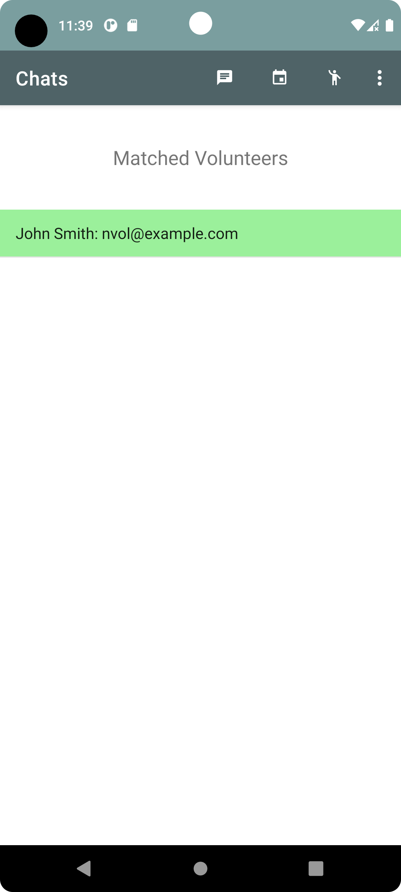

# EngageNow 🤝

Welcome to Engage Now, an app designed to help connect volunteers with local organizations and causes in need and make a positive impact on their communtiy. This app works much like the popular dating app, Tinder, allowing users to swipe through various volunteer opportunities and quickly match with the ones that interest them.

### Getting Started 🚀
To use Engage Now, simply create a profile and indicate your interests and availability. From there, you can start swiping through different volunteer opportunities and connect with the ones that align with your values and schedule.

### Features for volunteers:
* Create a profile and indicate your interests and availability 📄
* Swipe through various volunteer opportunities and quickly match with the ones that interest you 👆
* Connect with local organizations and causes in need in real time with in-app chat 🤝

### Features for organizations:
* Create new volunteering events
* Accept volunteers who like your events
* Connect with volunteers in realtime with the in-app chat

  
  
Swipe on events that interests you! 

  
  
Chat with organizations looking for volunteers

  
  
  
New messages are shown in your chat screen

  
  
  
Customize your profile

  
  
As an organization, see all your active events

  
  
  
Login any time

### Technologies Stack: 
* Front-end: Android Studio, Java.
* Back-end: Firebase: Authentication, Realtime Database, Storage, Cloud Messaging.

### Contributing
We welcome contributions from anyone who is interested in helping make Volunteer Match even better! If you'd like to contribute, please fork the repository and submit a pull request.

### Credits 
Engage Now was developed by Noah Fox 🦊, Omar Khater ⚽️, Wei-Chi Chou 🦍, and Brennan Allen 🐻‍❄️.
Please find the application here: https://play.google.com/store/apps/details?id=edu.fandm.engagenow

